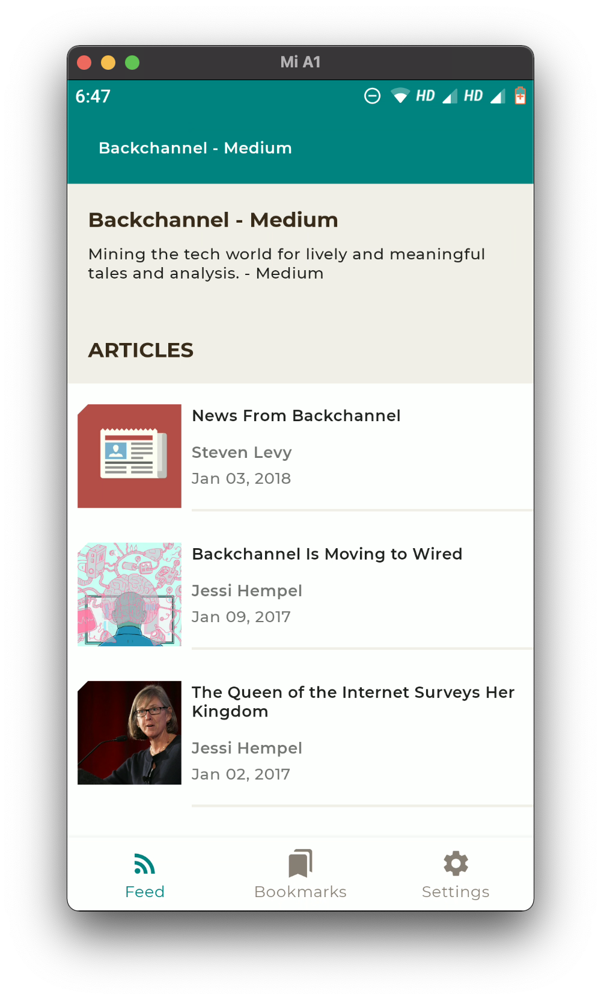
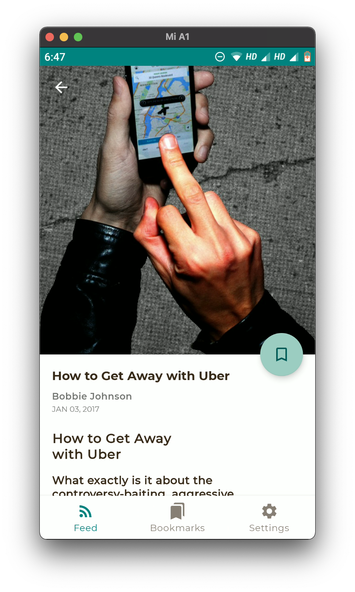

# Feedly - A RSS Reader App

> Note : This isn't a complete functional app. This was just created for explaining some concepts related to Multi-Module Android App architecture to someone.
> 
>
> Feel free to poke around. I'll add missing functionality whenever I get chance. 

## Sections
- [Architecture Diagram](#architecture-diagram)
- [App Screenshots](#app-screenshots)
- [Libraries](#libraries)
## Architecture Diagram

## App Screenshots
| Onboarding Screen | Channels Selected  | Home Screen | 
:------------------:|:------------------:|:-----------:|
 |  | 
 

| Article Detail Screen | Bookmarked Article | Bookmarks Screen | 
:----------------------:|:------------------:|:----------------:|
 |  | 

## Libraries

Refer to [Libraries.md](./Libraries.md) file to get details of all the libraries used in the project.
